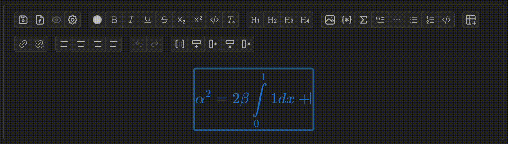
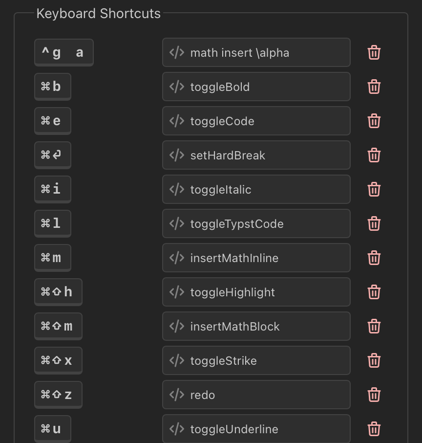
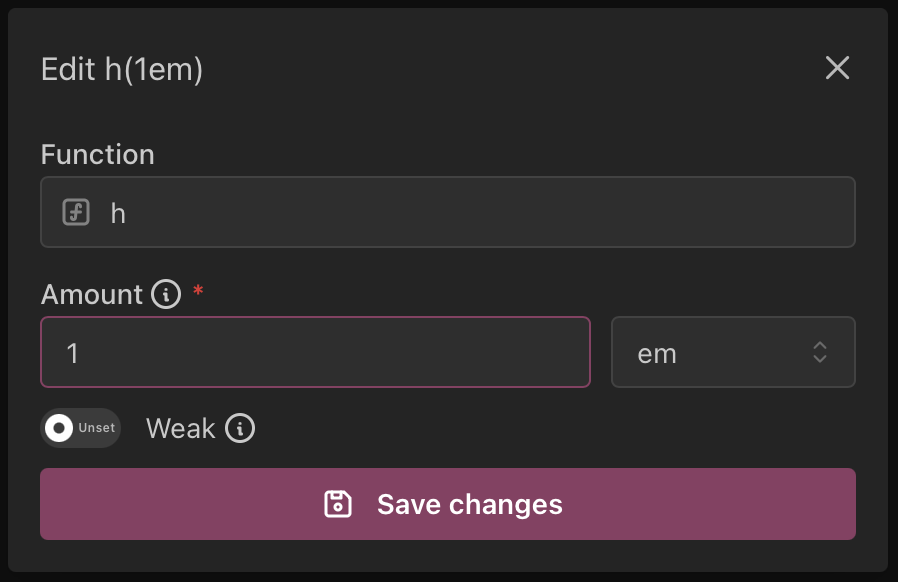
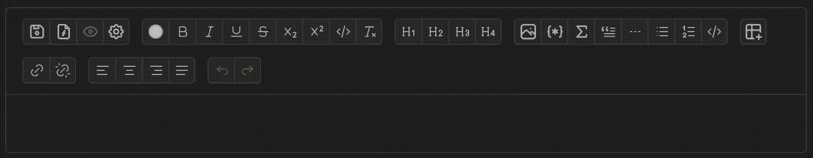

<h1 align="center">
    TyX
     
    
    
    
    
     
</h1>

    <b>A LyX-like experience rewritten for Typst and the modern era.</b>

> [!WARNING]
> TyX is currently in early development and breaking changes
> are introduced frequently.

## Getting Started

Check out the [web editor](https://app.tyx-editor.com) or [download TyX](https://tyx-editor.com)!

## Features

### Math Editor

TyX uses MathLive to make math formula editing easy by _seeing_ the formula you're editing!

> [!NOTE]
> This is currently LaTeX-based. We are working on a Typst-based editor!

### Keyboard Shortcuts

TyX supports customizable keyboard shortcuts!

### Function Calls

TyX supports an easy-to-use wrapper for Typst function calls, including types, labels and documentation for parameters!

> [!TIP]
> This is how the footnote node is currently implemented!

More definitions can be added to [the functions file](src/functions.ts).

### Keyboard Map

TyX supports keyboard maps (currently only a Hebrew keyboard map has been added [in the Keyboard Map Plugin](src/components/plugins/KeyboardMapPlugin.tsx)).
This enables you to write in your language without having to switch to English every time you edit math environments!

### Typst Importing

Thanks to [contributions by Myriad-Dreamin](https://github.com/tyx-editor/TyX/commits?author=Myriad-Dreamin) you can open `.typ` files into TyX!

> [!NOTE]
> This, as well, is still a work in progress.
> Many Typst features are currently not imported correctly.

### Translations

TyX currently has translations for Hebrew! Further translations can be added via GitHub PRs
by adding a file to [the translations directory](src/translations) and adding it to [the translations file](src/translations/index.ts).

## Acknowledgements

TyX would not be possible without the following open-source libraries:

- [typst](https://github.com/typst/typst/) (Apache-2.0 License)
- [typst.ts](https://github.com/Myriad-Dreamin/typst.ts/) (Apache-2.0 License)
- [tyx2typst](https://github.com/qwinsi/tex2typst/) (Apache-2.0 License)
- [tinymist](https://github.com/Myriad-Dreamin/tinymist/) (Apache-2.0 License)
- [mathlive](https://github.com/arnog/mathlive/) (MIT License)
- [lexical](https://github.com/facebook/lexical/) (MIT License)
- [tauri](https://github.com/tauri-apps/tauri/) (Apache-2.0/MIT License)
- [mantine](https://github.com/mantinedev/mantine/) (MIT License)
- [tabler](https://github.com/tabler/tabler-icons/) (MIT License)
- [vite](https://github.com/vitejs/vite/) (MIT License)
