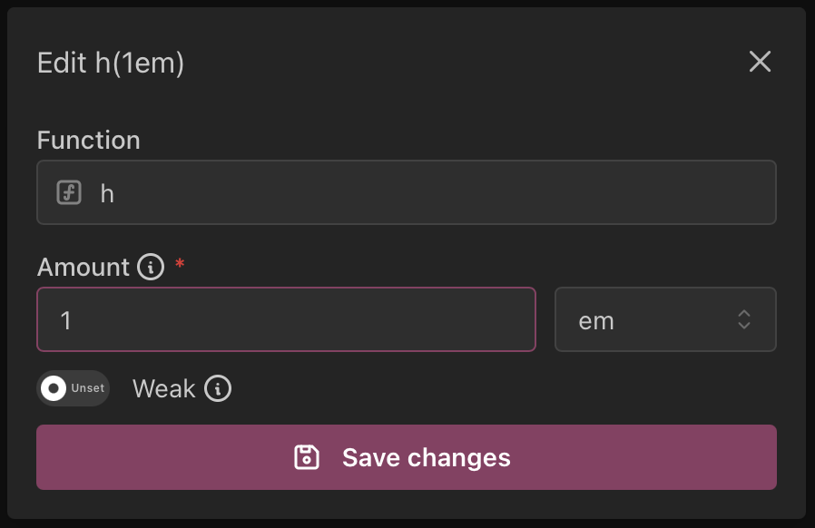

# Welcome to TyX's documentation!

**TyX** is a LyX-like experience rewritten for Typst and the modern era.
It is designed to create an easy-to-use, WYSIWYM interface inspired by LyX.

!!! warning

    TyX is currently in early development. Breaking changes are introduced
    frequently and the API is changing rapidly, as can be seen in the [changelog](https://docs.tyx-editor.com/en/latest/changelog.html).

    Keep this in mind!
    **Contributions are encouraged and welcomed!**

For installation and more details using TyX, see the [Getting Started](./getting-started.md) section!

## Features

### Math Editor

TyX uses MathLive to make math formula editing easy by _seeing_ the formula you're editing!

!!! note

    This is currently LaTeX-based. We are working on a Typst-based editor!

### Keyboard Shortcuts

TyX supports customizable keyboard shortcuts!

### Function Calls

TyX supports an easy-to-use wrapper for Typst function calls, including types, labels and documentation for parameters!

More definitions can be added to [the functions file](https://github.com/tyx-editor/TyX/blob/main/src/functions.ts).

### Keyboard Map

TyX supports keyboard maps (currently only a Hebrew keyboard map has been added [in the Keyboard Map Plugin](https://github.com/tyx-editor/TyX/blob/main/src/components/plugin/KeyboardMapPlugin.tsx)).
This enables you to write in your language without having to switch to English every time you edit math environments!

### Typst Importing

Thanks to [contributions by Myriad-Dreamin](https://github.com/tyx-editor/TyX/commits?author=Myriad-Dreamin) you can open `.typ` files into TyX!

!!! note

    This, as well, is still a work in progress.
    Many Typst features are currently not imported correctly.

### Translations

TyX currently has translations for Hebrew! Further translations can be added via GitHub PRs
by adding a file to [the translations directory](https://github.com/tyx-editor/TyX/tree/main/src/translations) and adding it to [the translations file](https://github.com/tyx-editor/TyX/blob/main/src/i18n.ts).
