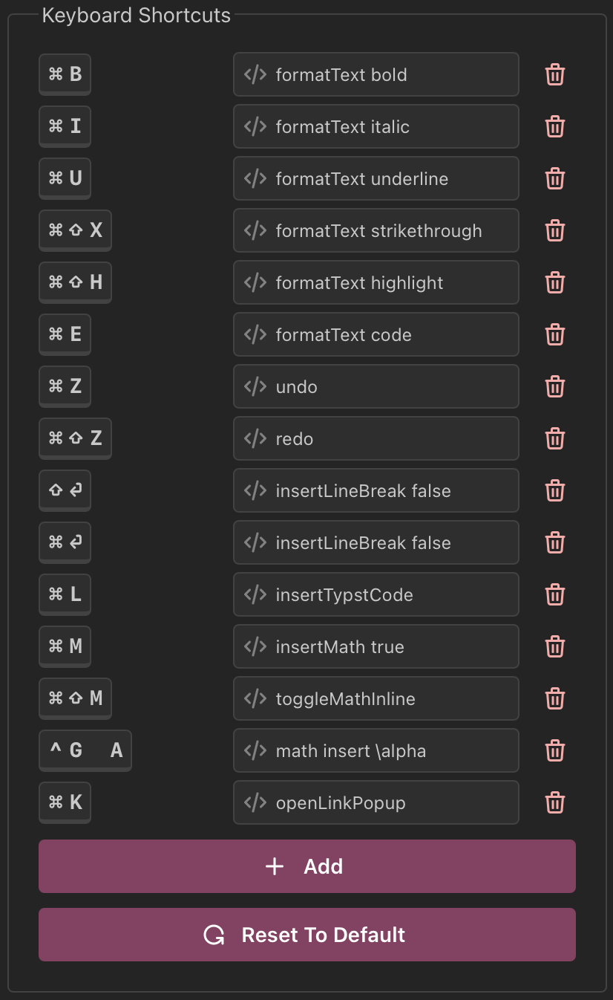

Welcome to TyX's documentation!
========================================

**TyX** is a LyX-like experience rewritten for Typst and the modern era.
It is designed to create an easy-to-use, WYSIWYM interface inspired by LyX.

.. warning::
    TyX is currently in early development. Breaking changes are introduced
    frequently and the API is changing rapidly, as can be seen in the `changelog <https://docs.tyx-editor.com/en/latest/changelog.html>`_.
    
    Keep this in mind!
    **Contributions are encouraged and welcomed!**

Features
--------

Math Editor
^^^^^^^^^^^

TyX uses MathLive to make math formula editing easy by *seeing* the formula you're editing!

.. video:: _static/math-editor.mp4
    :width: 100%

.. note::
    This is currently LaTeX-based. We are working on a Typst-based editor! 

Keyboard Shortcuts
^^^^^^^^^^^^^^^^^^

TyX supports customizable keyboard shortcuts!

Keyboard Map
^^^^^^^^^^^^

TyX supports keyboard maps (currently only a Hebrew keyboard map has been added `in the Keyboard Map TipTap Extension <https://github.com/tyx-editor/TyX/blob/main/src/components/editor/KeyboardMapExtension.ts>`_).
This enables you to write in your language without having to switch to English every time you edit math environments!

.. video:: _static/keyboard-map.mp4
    :width: 100%

Typst Importing
^^^^^^^^^^^^^^^

Thanks to `contributions by Myriad-Dreamin <https://github.com/tyx-editor/TyX/commits?author=Myriad-Dreamin>`_ you can open ``.typ`` files into TyX!

.. note::
    This, as well, is still a work in progress.
    Many Typst features are currently not imported correctly.

Translations
^^^^^^^^^^^^

TyX currently has translations for Hebrew! Further translations can be added via GitHub PRs
by adding a file to `the translations directory <https://github.com/tyx-editor/TyX/tree/main/src/translations>`_ and adding it to `the translations file <https://github.com/tyx-editor/TyX/blob/main/src/i18n.ts>`_.

.. toctree::
    :hidden:
    :caption: Introduction

    getting-started
    settings
    document-settings

.. toctree::
    :hidden:
    :caption: API Docs

    File Format <file-format>
    commands
    changelog